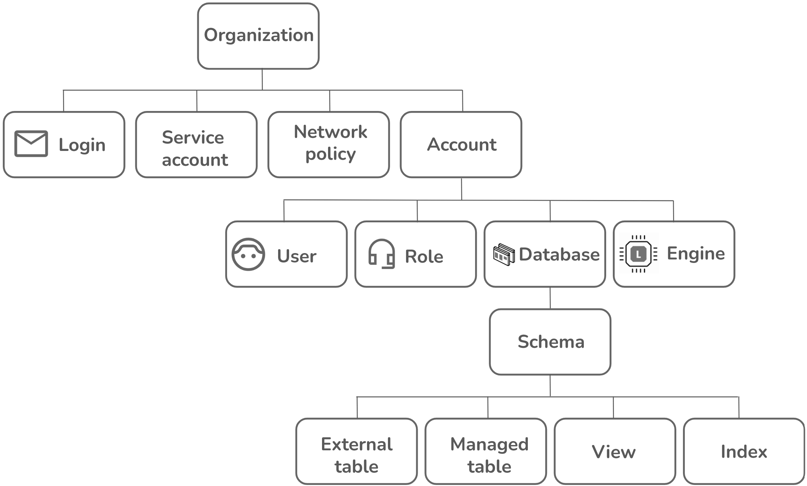
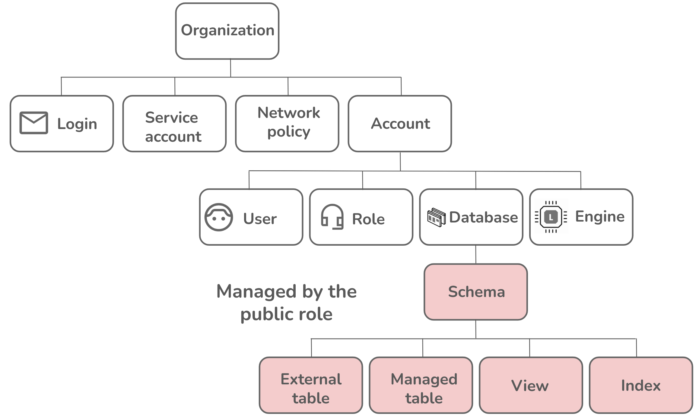
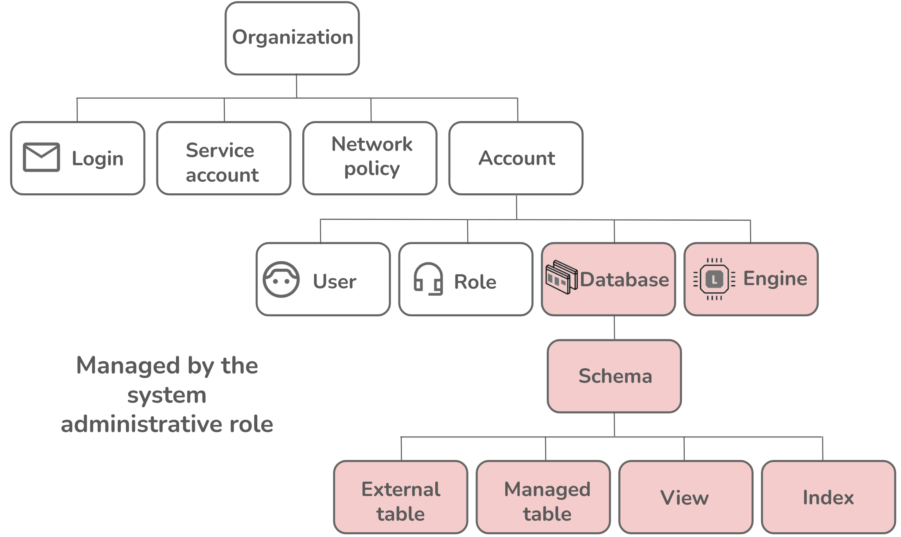
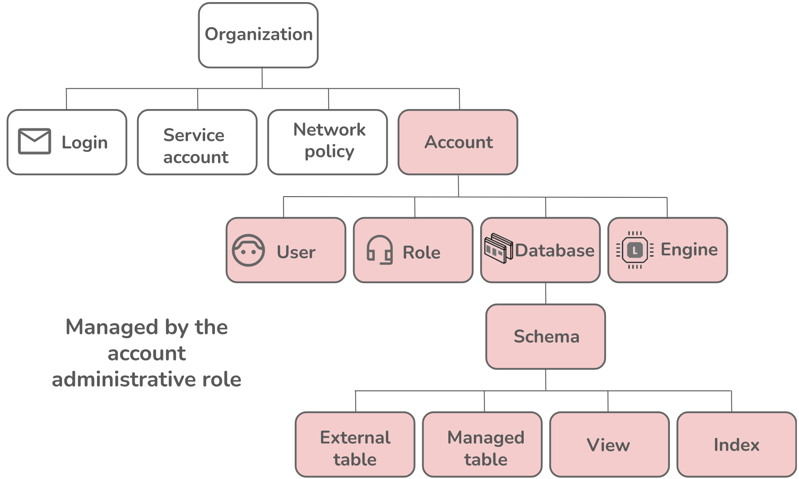
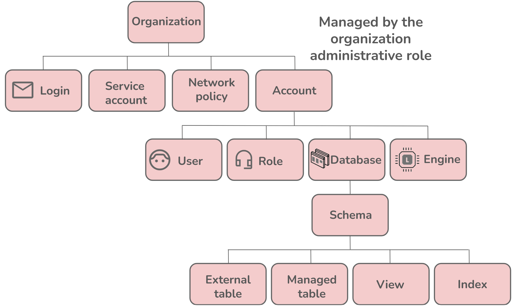

#  Register and set up your organization

 Welcome to Firebolt! This guide shows you how organizations in Firebolt work, with information about the following:

 * [Organizational structure](#organizational-structure) - How Firebolt structures your organization.
 * [Accounts](#accounts) - How Firebolt structures accounts, which can have multiple users, engines, and databases.
     * [Users](#users) - How users interact with accounts, roles, and your organizational structure.
 * [Roles](#roles) - What privileges you can assign to users. 
 
 When you register for the first time, Firebolt sets up an organization for you. During registration, you’ll set up your first account, with one user. The first user that is added is the account administrator, as shown in the following diagram:

 

Then, you can add resources and users to this account. The following apply:

* You can have multiple users within an account.
* A user should be associated with either a login email for personal access or to a service account, for programmatic access.
* You can have multiple accounts in an organization.
* Each account name within an organization must be unique.
* You can’t have one account in multiple AWS regions.
* You can add resources such as databases and engines to the account.

**Example**

In the following example structure, an organization has an account set up for their marketing department and for managers in two different AWS regions:

In the previous diagram, the organization has three separate accounts:

* A `marketing_account`, which has access to resources associated with marketing tasks, and two different users. The `user_1` user is associated with a `login_1` linked to an email account.
* A `manager_account_region_1`, which has access to resources associated with a manager account in one AWS region, and one `user_3` that is associated with login_1 linked the same email account as `user_1` in marketing_account.
* A `manager_account_region_2`, which has access to resources in a different region than `manager_account_region_1`, and one user also associated with `login_1`. 

The manager of the marketing department, `user_1`, is associated with `login_1`, which is associated with both the marketing account and both manager accounts. These accounts have access to a different set of resources and permissions. The users `user_1`, `user_3`, and `user_4` are all the same person because they have the same login and email. The manager also manages projects across AWS regions and must access those resources in a **different** account. Another employee, `user_2`, works in the marketing department and has access to only the marketing resources designated to `marketing_account` using permissions defined by his role.

# Organizational structure

Firebolt organizes your organization into a structure that includes **four** layers directly underneath it, as shown in the following diagram:

 Under organization are the following levels:

* **Login** - an email associated with a user that is used for identification. A single login can be associated with users across multiple accounts, but can only be associated with one user per account. For more information about logins, see [Manage logins](managing-logins.md).
* **Service account** - Use a service account to access Firebolt programmatically through an API. For more information about how to set up and manage a service account, see [Manage programmatic access](service-accounts.md).
* **Network policy** - Set a network security configuration that controls and restricts network access to specific resources within Firebolt based on IP addresses or IP ranges. See [Manage network policies](../security/network-policies.md).
* **Account** - A group of resources which can include a database, an engine and several users with associated logins or service accounts and roles. See the following [Accounts](#accounts) section for high-level information about accounts and [Manage accounts](managing-accounts.md) for more detailed information. Under account are the following levels:
    * **User** - An individual with specific permissions and roles that allow access to and interaction with the database and engine within an account. A user must be associated with a login (or service account), and with an account. See the following [Users](#users) section for more high-level information and [Manage users and roles](./managing-users.md) for more detailed information.
    * **Role** - A set of permissions that defines a user’s access and capabilities, which can be assigned to one or more users to manage their privileges. See the following Roles section for more high-level information and Manage users and roles for more detailed information.
    * **Database** - A logical collection of schemas and data objects, such as tables and views, that organizes and manages user data and metadata for querying and data processing. For more information about databases see [Create a Database](../getting-started/get-started-sql.md#create-a-database) in the [Get started using SQL](../getting-started/get-started-sql.md) guide. Under database are the following levels:
        * **Schema** - A collection of system views containing metadata about objects in the current database, including tables, columns, indexes, and other database components. For more information, see [Information Schema Views](../../sql_reference/information-schema/index.md). Under schema are the following levels:
            * **External table** - Tables that store metadata objects that reference files stored in an Amazon S3 bucket, rather than actual data. For more information, see [Work with external tables](../loading-data/working-with-external-tables.md).
            * **Managed table** - A Firebolt-managed internal structured data object within a database that stores rows and columns of data. Firebolt’s managed tables have built-in optimizations for fast query processing times. For more information, see [Working with tables](../../Overview/working-with-tables/working-with-tables.md).
            * **View** - A virtual table that represents the result of a stored query, including both user-defined views and [information schema views](../../sql_reference/information-schema/index.md), which provide metadata about database objects like tables, columns, and indexes.
            * **Index** - A database structure that optimizes data retrieval by organizing specific columns, improving query performance and enabling efficient filtering, sorting, and joining of datasets. For more information, see [Using Firebolt indexes](../../Overview/using-indexes.md).
    * **Engine** - A compute resource that processes queries and manages data operations and can be scaled independently and turned on or off as needed. For more information, see [Firebolt Engines](../../Overview/engine-fundamentals.md).

## Accounts

Each account in Firebolt exists in a single AWS region, and can have engines and databases associated with it. Initially after registration, an account contains no resources, and only one user that has an account administrator role. An account can contain many users, as shown in the following diagram: 

### Users

A user must be associated with a role, which grants them permission to access resources. These users can be associated with different roles within a single account. Each user must be associated with either a login for personal access or a service account for programmatic access, as shown in the following diagram:

A login consists of an **email address**. This login uniquely identifies the user.

**Example**

In the following example account structure, `user_1` has a manager role that grants access to engines and databases associated with human resources tasks, as well as a marketing role that grants them access to everything that their employee has access to. A marketing employee, `user_2`, has read-only access to the tables in the database in `marketing_account`, but they cannot insert new entries or delete entries from a table.

### Roles

In Firebolt, each user is associated with either a **login**, which is an email address, or a **service account**. Each user must also have a role, as shown in the following diagram:

The role grants the user permission to access resources inside the account that they are associated with. A user can have several roles associated with them at the same time. Firebolt has built-in roles with defined permissions. You can also define a [custom role](../security/rbac.md#custom-roles) that grants permissions specific to your use case.

#### Firebolt built-in roles

Firebolt has the following built-in roles with associated permissions for objects including databases, engines, users, network policies, and accounts:

* [Public role](#public-role)
* [System administrative role](#system-administrative-role)
* Account administrative role
* Organizational administrative role

##### Public role

A public role is associated with a user that can:
* Use a database.
* Use a public schema.
* Create a public table.
* Create a public view.
* Create a public index.
* Create a public external table.

A public role has the **lowest** access privileges of all roles in Firebolt, as shown in the following diagram: 

##### System administrative role

A system administrative role has privileges to manage databases, engines, schemas, and objects within those schemas. A system administrator can:

* Create a database in an account.
* Create an engine in an account.
* Monitor engine use.
* Has all privileges for:
    * Any database and its properties.
    * Any engine and its properties.
    * Any schema.
    * Any view.
    * Any external table.

The previous system administrative privileges are shown in the following diagram:

##### Account administrative role

An account administrative role includes all privileges associated with system administrators and can also manage accounts and users. An account administrator has:

* All system administrator privileges.
* All privileges for an account.
* The ability to meter and monitor account use.
* The ability to cancel a query on any engine in an account.

The previous account administrative privileges are shown in the following diagram:

##### Organizational administrative role

An organizational administrative role has all privileges associated with system administrators and can also manage accounts and users. An organizational administrator has:

* All privileges for an organization.
* All privileges for any account in an organization.
* All privileges for any login in an organization.
* All privileges for any service account in an organization.
* All privileges for any network policies in an organization.
* The ability to monitor any usage in the organization
* The ability to set any organization-related property.

An organizational administrative role has the **highest** access privileges of all roles in Firebolt, as shown in the following diagram:

# Additional resources

## Manage billing

Firebolt bills are based on the consumption of resources within each account in your organization. This includes the total amount of data stored and engine usage. Learn how to [manage billing](billing.md) with observability at both the organization and account levels. 

## Security

Learn about authentication methods, role-based access control, network policies, and object ownership in [Configure security](../security/index.md).

## Available regions

View the [AWS regions](../../Reference/available-regions.md) where you can use Firebolt.